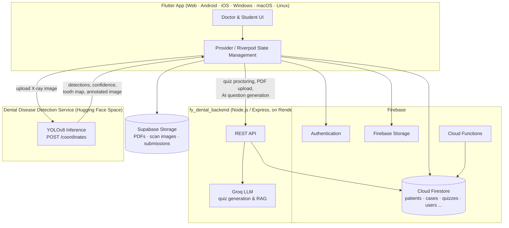
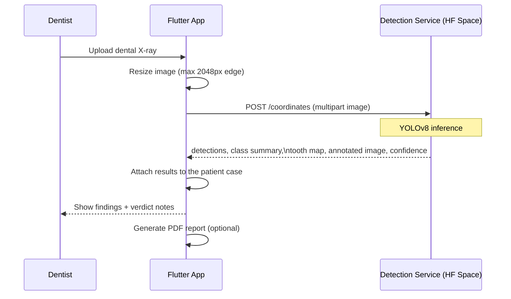
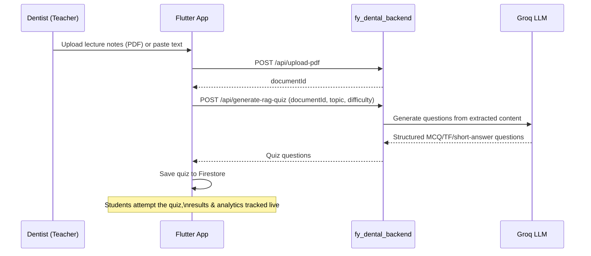

<div align="center">


# PalPath

**An integrated dental clinic management system with AI-powered disease detection from dental X-rays.**

Final Year Project · BS Computer Science · Bahria University, Lahore

[](https://flutter.dev)
[](https://firebase.google.com)
[](https://nodejs.org)
[](#-ai-disease-detection)
[](#-license)

[Live App](https://dental-care-6daf8.web.app) · [Features](#-features) · [Architecture](#-architecture) · [Getting Started](#-getting-started)

</div>

---

## 📖 About

Most dental software does one job, not both: practice-management tools handle patients, appointments and records but can't read an X-ray, while AI imaging tools can flag a cavity but have no idea who the patient is or what a clinic's day looks like. **PalPath** was built to close that gap.

The idea came directly from a practising dentist who also teaches dentistry — someone who needed a clinical tool and a teaching tool at the same time. PalPath combines the two into one platform:

- **Clinical management** — patients, cases, scans, treatment plans, prescriptions, appointments
- **AI-assisted diagnosis** — a YOLOv8 model detects dental disease from X-ray images and returns confidence-scored, tooth-mapped results
- **Teaching & assessment** — lecture notes, assignments, and AI-generated quizzes (via Groq LLM) for dental students

It targets small and mid-sized clinics, dental teaching institutions, and settings where access to specialist diagnosis is limited — supporting UN SDG 3 (Good Health), SDG 4 (Quality Education) and SDG 9 (Industry, Innovation & Infrastructure).

## ✨ Features

<table>
<tr>
<td valign="top" width="50%">

### For Dentists
- Patient registration & medical history
- Case documentation with multi-image scan uploads
- AI dental disease detection with confidence scoring & FDI tooth mapping
- Case comparison / progression tracking over time
- Treatment planning & digital prescriptions
- Appointment scheduling
- AI-powered quiz generation from lecture notes (direct text or PDF/RAG)
- Assignment creation & grading
- Student performance analytics & leaderboards
- PDF report generation (medical + quiz reports)
- Audit logging for compliance

</td>
<td valign="top" width="50%">

### For Students
- LMS dashboard with available quizzes & recent activity
- Timed quiz attempts with exam-integrity proctoring (tab-switch / fullscreen / inactivity detection)
- Detailed results with explanations
- Personal performance analytics vs. class average
- Lecture notes & learning materials
- Assignment submission & grading feedback
- Quiz bookmarks & notifications

</td>
</tr>
</table>

## 🧠 AI Disease Detection

Dental X-rays are analyzed by a **YOLOv8** object-detection model, served from a dedicated inference API and called from the Flutter app.

| Metric | Score |
|---|---|
| Precision | ~0.91 |
| Recall | ~0.90 |
| mAP@0.5 | ~0.91 |

Trained on Google Colab Pro (NVIDIA Tesla T4) over 50–100 epochs, after cleaning a raw dataset that suffered from low contrast, noise, blur and inconsistent annotations. The model returns bounding boxes, per-class detection counts, an FDI tooth-numbered map, an annotated image, and a clinical summary — it is designed to **support**, not replace, a dentist's judgement.

## 🏗 Architecture



### AI detection request flow



### AI quiz generation flow (RAG)



## 🛠 Tech Stack

| Layer | Technology |
|---|---|
| Frontend | Flutter (Dart), Provider + Riverpod |
| Auth & Database | Firebase Authentication, Cloud Firestore |
| File Storage | Supabase Storage (scans, PDFs, submissions), Firebase Storage |
| Backend API | Node.js, Express (deployed on Render) |
| AI — Quiz Generation | Groq LLM (RAG over uploaded lecture notes) |
| AI — Disease Detection | YOLOv8, served as a REST API |
| Reporting | `pdf` / `printing` packages for PDF generation |
| Platforms | Web, Android, iOS, Windows, macOS, Linux |

## 📁 Project Structure

```
FYP/
├── dental_care/           # Flutter application (main app)
│   ├── lib/
│   │   ├── models/        # Data models (patient, case, quiz, scan, ...)
│   │   ├── provider(s)/   # State management
│   │   ├── service/       # Firebase, AI detection, Groq/RAG, PDF, caching
│   │   ├── view/          # Screens (doctor + student)
│   │   ├── features/      # Feature modules (analytics, lecture notes, ...)
│   │   └── core/          # Theming, responsive layout, routing
│   ├── functions/         # Firebase Cloud Functions
│   ├── test/               integration_test/
│   └── firestore.rules, firebase.json, pubspec.yaml
│
├── fy_dental_backend/     # Express backend (quiz proctoring, PDF/RAG, Groq)
│   ├── server.js
│   └── README.md          # Backend-specific setup & API docs
│
└── .github/workflows/     # CI/CD — Firebase Hosting deploy on push to main
```

## 🚀 Getting Started

### Prerequisites
- [Flutter SDK](https://flutter.dev) 3.1+
- [Node.js](https://nodejs.org) 18+
- A Firebase project (Firestore + Authentication enabled)
- A Supabase project (for file storage)
- A [Groq API key](https://console.groq.com) (for AI quiz generation)

### 1. Clone the repo

```bash
git clone https://github.com/SayyedainDev/FYP.git
cd FYP
```

### 2. Run the Flutter app

```bash
cd dental_care
flutter pub get
flutterfire configure   # connect to your own Firebase project
flutter run -d chrome    # or: android / windows / macos / linux
```

### 3. Run the backend API

```bash
cd fy_dental_backend
npm install
cp .env.example .env     # add GROQ_API_KEY, FIREBASE_SERVICE_ACCOUNT
npm run dev
```

See [`fy_dental_backend/README.md`](fy_dental_backend/README.md) for full API documentation and Render deployment steps.

## ☁️ Deployment

- **Flutter Web** → Firebase Hosting, deployed automatically via GitHub Actions on push to `main` (see [`.github/workflows/firebase-hosting-deploy.yml`](.github/workflows/firebase-hosting-deploy.yml))
- **Backend API** → Render
- **AI Detection Service** → Hugging Face Spaces

## 🧪 Testing

The Flutter app includes widget tests (`dental_care/test`) covering authentication, dashboards, case creation, quiz listing and settings, plus integration tests (`dental_care/integration_test`) covering navigation and end-to-end feature flows.

```bash
cd dental_care
flutter test
```


## 🎓 Academic Context

PalPath was developed as a Final Year Project for the BS Computer Science degree at **Bahria University, Lahore**. It was built as self-funded academic work, shaped directly by the real workflow of a practising dentist and dental educator, rather than as contract research.

## 👥 Team

- [Sayyedain](https://github.com/SayyedainDev)
- [Sabeeh](https://github.com/Sabstar71)

## 📄 License

This is an academic Final Year Project. All rights reserved by the authors — the code is shared publicly for portfolio, evaluation and educational purposes and is **not** licensed for reuse, redistribution or commercial use without permission. IP evaluation and any commercialization path (licensing, further research, or new venture) is still under consideration.
